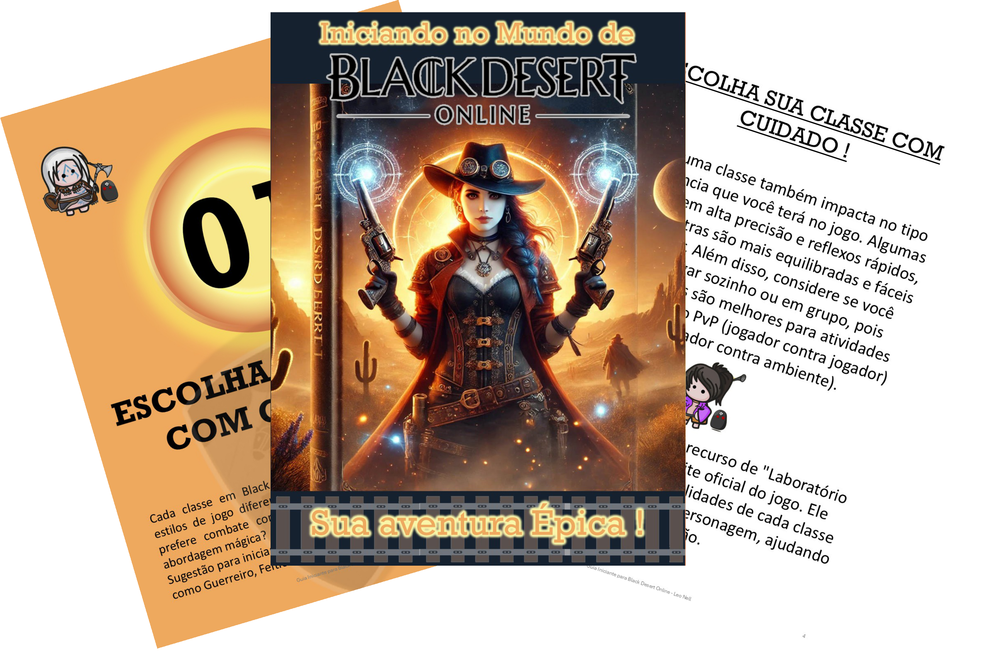

    

-------

# Projeto EBOOK Gerado por I.A.s

 > ℹ️ **NOTE:** Este é o repositório desenvolvido durante o curso que fiz na plataforma da [DIO](https://dio.me)

Projeto com o objetivo de gerar um ebook digital com as facilidades das ferramentas de IA. todos os prompts
seguem abaixo.

output/Ebook - Black Desert.pdf
<a href="https://github.com/felipeAguiarCode/prompts-recipe-to-create-a-ebook/blob/main/output/ebook%20-%20css%20jedi%20output.pdf" title="View PDF now"> 📕Clique aqui para ler</a>
<a href="output/Ebook - Black Desert.pdf" title="View PDF now"> 📕Clique aqui para ler</a>
## 💻 Tecnologias utilizadas no projeto

- [ChatGPT](https://chat.openai.com/) 
- [PowerPoint](https://www.microsoft.com/en/microsoft-365/powerpoint)

## 🧠 Prompts

ChatGPT：

|   Ação   | prompt                                                                                                                                                                                                                                                                         |
| :------: | ------------------------------------------------------------------------------------------------------------------------------------------------------------------------------------------------------------------------------------------------------------------------------ |
|  título  | Crie um titulo de um ebook sobre o tema do jogo Black Desert Online, o ebook e do nicho de jogos de RPG online, e subnicho de jogadores iniciantes, o titulo deve ser epico e curto, e que tenha uma tematica para iniciantes, me liste 5 variaçoes de titulos.                                                        |
| conteúdo | Faça um texto para ebook, com base no jogo Black Desert Online, indicando os primeiros passos para um jogador iniciante. {REGRAS} Explique sempre de uma maneira simples Deixe o texto enxuto,  , sempre deixe um título sugestivo por tópico |

ChatGPT：

|  Ação  | prompt                                                                                 |
| :----: | -------------------------------------------------------------------------------------- |
| título | Retratar imagine uma imagem para a capa do meu ebook "Iniciando no Mundo de Black Desert: Sua Aventura Épica" |

## ✨ Features

- Conteúdo gerado via ChatGPT
- Imagens geradas via ChatGPT

## 📚 Materiais

- Imagens utilizadas em `assets`
- ebook gerado durante as aulas em `output`

## 🛠️ Instruções de execução

Utilize os prompts acima nas ferramentas sugeridas para gerar o material base e utilize uma ferramenta de edição de documentos como power point, libreoffice , indesign para diagramação.

## 👨‍💻 Expert

